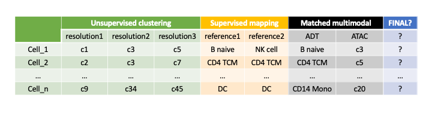

[](https://sctriangulate.readthedocs.io/en/latest/?badge=latest)  [](https://pypi.org/project/sctriangulate/)  [](https://pypi.org/project/sctriangulate/)  [](https://github.com/frankligy/scTriangulate/stargazers) [](https://zenodo.org/badge/latestdoi/351979355)


# scTriangulate

scTriangulate is a Python package to mix-and-match conflicting clustering results in single cell analysis, and generate reconciled clustering solutions.

scTriangulate leverages cooperative game theory (Shapley Value) in conjunction with complimentary stability metrics (i.e. reassign score, TFIDF score and SCCAF score) to intelligently integrate clustering solutions from nearly unlimited sources. Applied to multimodal datasets, this approach highlights new cell populations and mechanisms underlying lineage diversity.

Please don't hesitate to reach out to me if you have any questions (contact down the page), I will be responsive.

## Overview


It can be used in an array of settings:

1. Integrate results from the same or multiple unsupervised clustering algorithms (i.e. Leiden, Seurat, SnapATAC) using different resolutions.

2. Integrate results from both unsupervised and supervised (i.e. cellHarmony, Seurat label transfer) clustering algorithms.

3. Integrate results from different reference atlases.

4. Integrate labels from multi-modality single cell datasets (CITE-Seq, Multiome, TEA-Seq, ASAP-Seq, etc.).



## Tutorials and Installation

Check out our [full documentation and step-by-step tutorials](https://sctriangulate.readthedocs.io/en/latest/get_started.html). But let's get a quick sense for a minimum example, it has been tested in python>=3.7 on MacOS, Linux and Windows PC.

```bash
pip install sctriangulate
```

```python
import scanpy as sc
from sctriangulate import *
from sctriangulate.preprocessing import *
from sctriangulate.colors import *

# If you are using Mac or PC, set Matplotlib backend as Agg
sctriangulate_setting(backend='Agg')

# If you are using Linux server, make sure you have internet connections

# Your adata should have:
# (a) adata.X, properly normalized (i.e. log CPTT for RNA, CLR for ADT, etc), check sctriangulate.preprocessing.Normalization for various choices
# (b) at least two columns representing conflicting annotations in adata.obs, passed to query argument
# (c) adata.obsm['X_umap'] for automatically generate visualization, check sctriangulate.preprocessing.scanpy_recipe to generate umap 
# (d) don't have adata.raw attribute, if have, del adata.raw, this will interfere how scanpy calculate marker genes

adata = sc.read('./test/input.h5ad')
sctri = ScTriangulate(dir='./output',adata=adata,query=['sctri_rna_leiden_1','sctri_rna_leiden_2','sctri_rna_leiden_3'])
sctri.lazy_run()

# All the results will be saved in the dir you specified
```

## Docker

You can run the main functionalities using a docker container:

```bash
docker pull frankligy123/sctriangulate:0.12.0.1
# imagine you are in the folder where your input.h5ad file sits, and you want to save your results to a new folder in the
# same directory as ./output, here is how you run the docker
docker run -v $PWD:/usr/src/app/run -t frankligy123/sctriangulate:0.12.0.1 --adata_path ./run/input.h5ad \
           --dir_path ./run/output --query sctri_rna_leiden_1 sctri_rna_leiden_2 sctri_rna_leiden_3
# access help page
docker run -v $PWD:/usr/src/app/run -t frankligy123/sctriangulate:0.12.0.1 --help
```


## Citation

Li, G., Song, B., Singh, H. et al. Decision level integration of unimodal and multimodal single cell data with scTriangulate. Nat Commun 14, 406 (2023). https://doi.org/10.1038/s41467-023-36016-y

## Reproducibility

All scripts for reproducing the analyses in the preprint are available in the [reproduce folder](https://github.com/frankligy/scTriangulate/tree/main/reproduce), along 
with all the necessary input files and intermediate outputs which are avaiable in [Synapse storage](https://www.synapse.org/#!Synapse:syn26320337/files/).

## Contact

Guangyuan(Frank) Li

Email: li2g2@mail.uc.edu

PhD student, Biomedical Informatics

Cincinnati Children’s Hospital Medical Center(CCHMC)

University of Cincinnati, College of Medicine
