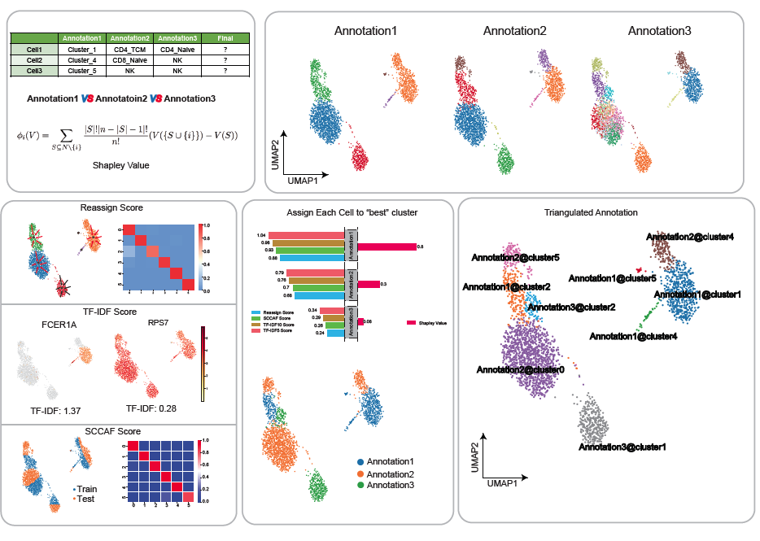

.. scTriangulate documentation master file, created by
   sphinx-quickstart on Thu Jul 22 16:24:43 2021.
   You can adapt this file completely to your liking, but it should at least
   contain the root `toctree` directive.

Get started
===================

Hi, Welcome to scTriangulate tutorials, here are some suggestive steps to quickly get a hang of this tool:

1. Background: :ref:`reference_to_overview`
2. :ref:`reference_to_single_modality_workflow`
3. :ref:`reference_to_multi_modal_workflow`
4. :ref:`reference_to_visualization`

Contents
===============

.. toctree::
   :maxdepth: 2

   install
   introduction
   tutorial
   principle
   api
   contact

