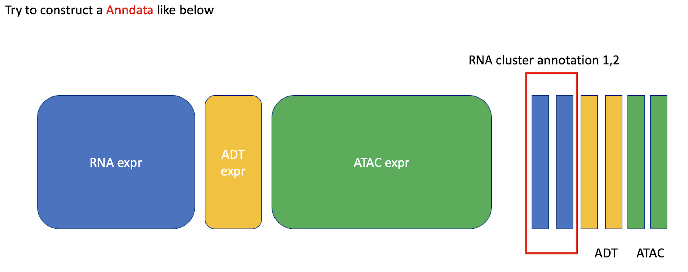

Introduction
=================

.. _reference_to_overview:

What is scTriangulate?
------------------------
scTriangulate is a python3 package designed to harmonize ``conflicting annotations`` in single cell genomics studies. 
While this approach can be applied to any situation in which the same dataset has multiple conflicting annotations, common challenges includes:

1. Integrate results from the same or multiple unsupervised clustering algorithms (i.e. Leiden, Seurat, SnapATAC) using different ``resolutions``.

2. Integrate results from both unsupervised and supervised (i.e. cellHarmony, Seurat label transfer) ``clustering algorithms``.

3. Integrate results from different ``reference atlases``.

4. Integrate labels from ``multi-modality`` single cell datasets (CITE-Seq, Multiome, TEA-Seq, ASAP-Seq, etc.).

.. image:: ./_static/schema_chop.png
   :height: 180px
   :width: 800px
   :align: center
   :target: target

scTriangulate enables the user to ``mix-and-match`` individual clustering results by leveraging customizable 
statistical measures of single cell cluster stability in combination with a cooperative game theory approach (`Shapley Value <https://en.wikipedia.org/wiki/Shapley_value>`_) 
to obtain an single optimal solution.

.. note::
    A typical scRNA-Seq dataset (10k cells) with four provided annotation-sets can run in ~10 minutes on a laptop. For larger datasets (100k cells) or multiome 
    (GEX + ATAC) with > 100k features (gene + peak), it is recommended to run the software in a high-performance compute environment.

Inputs and Outputs
---------------------
scTriangulate has no limitations on the modalities you are working with, so far we have provided supports for ``RNA``, ``ADT``, ``ATAC``, ``Splicing``, ``DNA mutation``,
All you need to do is to construct an ``anndata`` that has the features expression values associated with each modality (i.e. gene for RNA, surface 
protein for ADT, peak or bins or kmers or motifs for ATAC, PSI values for splicing, a binary matrix indicating whether a cell has mutation or not for mutation data, etc).
Furthermore, we are planning to support TCR/BCR and spatial data in the future, the key is still how to select informative features from these new modalities. A pictorial 
presentation of how the count matrix and annotations can be set up in multi-modal setting:

scTriangulate works seemlessly with the popular `scanpy <https://scanpy.readthedocs.io/en/stable/>`_ package. Although scTriangulate operates on ``AnnData``, we
provided a myriad of preprocessing functions to convert most of frequently-encountered file formats, accomodating all user cases.

    1.  If you already have **Anndata** (.h5ad), Your feature matrix (concating all modalities features as shown above) should be at ``.X``, conflicting annotations should be the columns of ``.obs``, 
        and normaly you would have ``.obsm['X_umap']`` key filled with your preferred UMAP coordinates (Please refer to :ref:`reference_to_add_umap` function for details if needed), 
        if pre-computed UMAP is not available, you can refer to function :ref:`reference_to_scanpy_recipe` to generate UMAP from your data.

    2. If your count matrix is in **mtx** format, and you have additional annotation file (and umap coordinate) as plain text file, You can consider using these functions
       (:ref:`reference_to_mtx_to_adata`, :ref:`reference_to_add_annotation`, :ref:`reference_to_add_umap`) to construct Anndata as described above.

    3. If your count matrix is in **dense txt** format, and you have additional annotation file (and umap coordinate) as plain text file, You can consider using these functions
       (:ref:`reference_to_small_txt_to_adata`, :ref:`reference_to_add_annotation`, :ref:`reference_to_add_umap`) to construct Anndata as described above. An example annotation plain txt
       file looks like below:

.. note::
    In the scenario where the dense matrix is super large (>10GB), reading it into memory can take huge amount of time and a better way to resolve it is to first
    convert it to a mtx file, so that repetitively reading in will be more time efficient. For that, please refer to function :ref:`reference_to_large_txt_to_mtx` and function
    :ref:`reference_to_mtx_to_adata`.

.. csv-table:: annotation txt file
    :file: ./_static/annotation_txt.csv
    :widths: 10,10
    :header-rows: 1

All of the intermediate outputs and final clustering results, plus interactive visualization, will be automatically named and saved to the user-defined
directory. Each function provides a `save` argument, which allows the users to modify this default behaviour. 

With that, feel free to jump to the :ref:`tutorials` to get a sense about how to run the program (super easy)!

