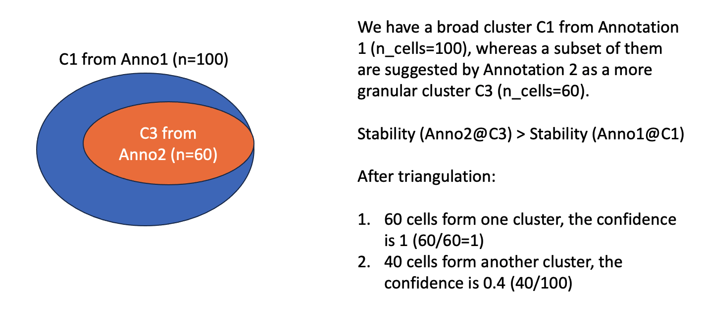

Troubleshooting
==================

Error getting the Enrichr libraries
-------------------------------------------------

Error like that::

    Traceback (most recent call last):
    File "./run.py", line 18, in <module>
    sctri.lazy_run(scale_sccaf=False)
    File "/data/salomonis2/LabFiles/Frank-Li/scTriangulate/pbmc3k_test/sctriangulate/main_class.py", line 383, in lazy_run
    self.compute_metrics(parallel=compute_metrics_parallel,scale_sccaf=scale_sccaf)
    File "/data/salomonis2/LabFiles/Frank-Li/scTriangulate/pbmc3k_test/sctriangulate/main_class.py", line 704, in compute_metrics
    collect = collect.get()
    File "/data/salomonis2/LabFiles/Frank-Li/citeseq/scanpy_new_env/lib/python3.6/multiprocessing/pool.py", line 644, in get
    raise self._value
    Exception: Error getting the Enrichr libraries

The reason is, the GESAPY package, which performs gene enrichment analysis automatically in the scTriangulate program, needs internet connection.
So if you are using Linux high-performance compute environment, please make sure the program can have access to Enrichr database. This restriction 
maybe resolved in the future version.

Job killed or halted because reaching the maximum RAM
-----------------------------------------------------------

The reason is, by default scTriangulate will utilize python standard library multiprocessing to automatically employ multiple cores for faster
computation, however, it comes at the cost of memory footprint. In the cases of very large dataset (100k cells or 100k features) with more than 5 
annotation-sets, it may reach the maximum RAM that you allocate. If that happen, just simply change the argument ``compute_metrics_parallel=False``::

  sctri.lazy_run(compute_metrics_parallel=False)

Compute TFIDF on integrated expression matrix (with negative value)
----------------------------------------------------------------------

Since TFIDF score computation looks for zero and non-zero value for a gene to represent whether a gene is specifically present in a population or not. Normally, raw count 
matrix or properly normalized data (CPTT, CLR) won't violate the non-negativity and you can use those normalized expression matrix as it is. But as you can imagine,
when you have an integrated expression matrix post batch-effect correction (say after running MNN or TotalVI), it is likely certain entries become negative, this will 
affect the TFIDF score computation. In this scenario, you can follow the steps below, in addition to supply your integrated matrix to ``adata.X``, you may need to provide
another layer of the expression matrix using either raw count or other normalized version with non-negative value to ``adata.layers``, and specify which ``layer`` the TFIDF
function should look for when computing the score in running ``lazy_run`` function. More explanation of the adata layers slot can be found in `AnnData <https://anndata.readthedocs.io/en/latest/generated/anndata.AnnData.layers.html>`_::

    # imagine you have two dataframe df_integrated, df_raw_count in the RAM, refer to all various preprocessing functions to facilate the IO process
    # df_integrated and df_raw_count is of the same shape (n_cell,n_feature), but former one is integrated data with negative value,
    # the latter one is the raw count data.
    # if the shape are slightly different say the df_integrated removed certain cell barcodes, make sure to be consistent for your df_raw_count as well.

    # first make sure the feature order and the cell barcode order are the same
    df_raw_count = df_raw_count.loc[df_integrated.index,df_integrated.columns]

    # assuming integrated matrix has been added to your adata.X, and you have a few conflicting cell annotations in your adata.obs columns
    # then you will just need to add this raw count piece into adata.layers, using a customed key value, say ['raw_count']
    key = 'raw_count'
    adata.layers[key] = df_raw_count.values

    # Now you can start to run scTriangulate, just add a layer paramter when executing lazy_run
    sctri = ScTriangulate(dir='output',adata=adata,query=['annotation1','annotation2','annotation3'])
    sctri.lazy_run(layer='raw_count')

    # or if you just want to compute metrics
    sctri.compute_metrics(layer='raw_count')

How is confidence score computed?
------------------------------------

