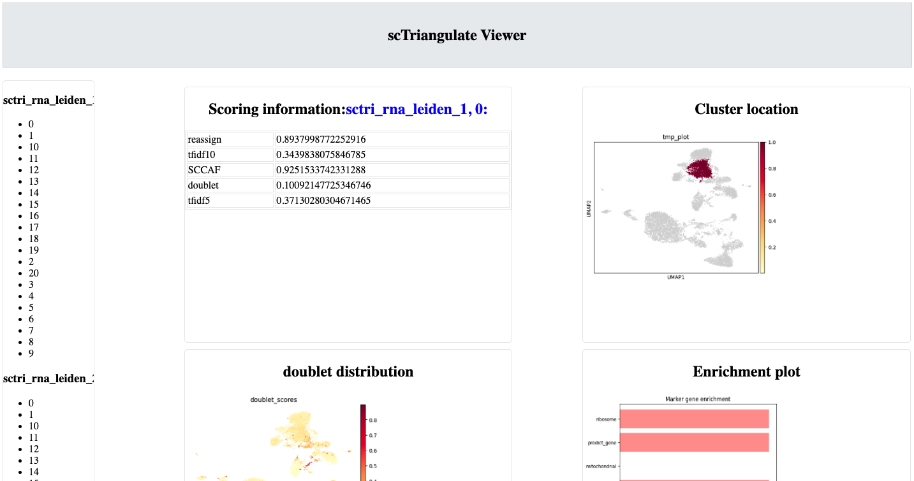
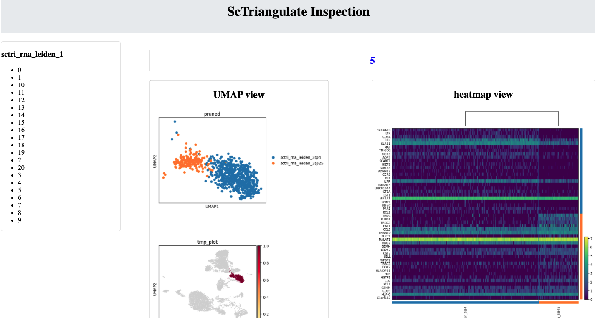
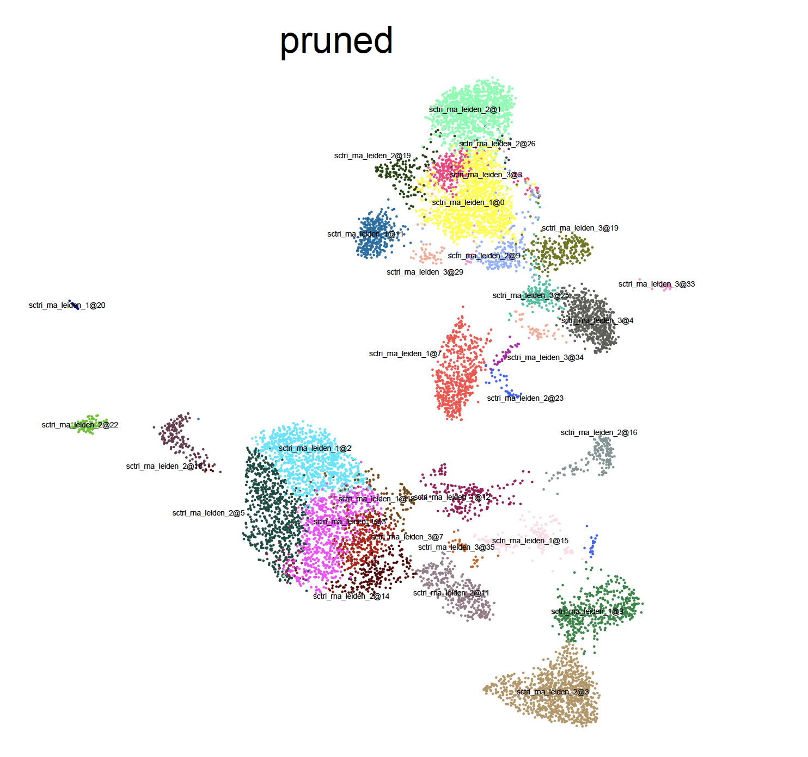
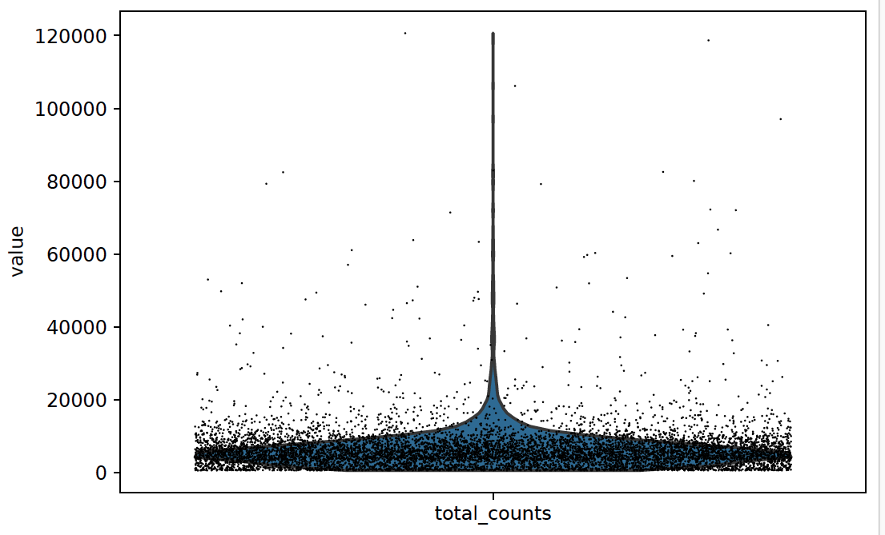
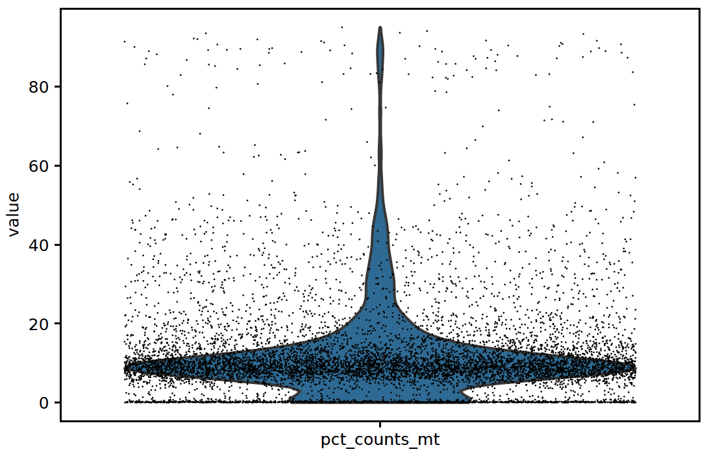
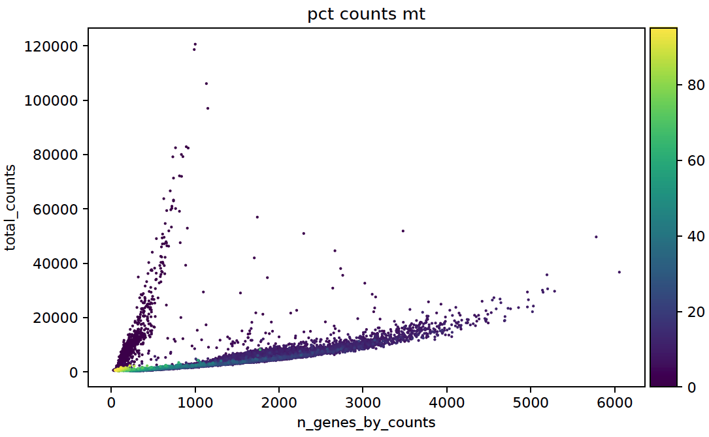

Tutorial
==========

.. _reference_to_single_modality_workflow:

Single Modality (scRNA) workflow
-----------------------------------

In this example, we are going to analyze pbmc10k scRNA dataset downloaded from 
`10x official website <https://support.10xgenomics.com/single-cell-gene-expression/datasets/3.0.0/pbmc_10k_v3>`_ (chemistry v3.1). This dataset
has also been used as the demo query data in `Azimuth <https://azimuth.hubmapconsortium.org/references/#Human%20-%20PBMC>`_. It contains 11,769 single 
cells before filtering.

Here we first conduct basic single cell analysis to obtain Leiden clustering results, however, at various resolutions (r=1,2,3). Smaller resolutions lead to
broader clusters, and larger resolution value will result in more granular clustering. We leverage scTriangulate to take the three resolutions as the query 
annotations, and automatically mix-and-match cluster boundary from different resolutions, which at the end, yield scTriangulate reconciled cluster solutions.

Download and preprocessing
~~~~~~~~~~~~~~~~~~~~~~~~~~~~~

First load the packages::

    import os
    import sys
    import scanpy as sc
    from sctriangulate import *
    from sctriangulate.preprocessing import *

The h5 file can be downloaded from `here <http://altanalyze.org/scTriangulate/scRNASeq/pbmc_10k_v3.h5>`_. We used scanpy and scTriangulate
preprocessing module to conduct basic QC filtering and single cell pipeline::

    adata = sc.read_10x_h5('./pbmc_10k_v3_filtered_feature_bc_matrix.h5')
    adata.var_names_make_unique()
    adata.var['mt'] = adata.var_names.str.startswith('MT-')  # annotate the group of mitochondrial genes as 'mt'
    sc.pp.calculate_qc_metrics(adata, qc_vars=['mt'], percent_top=None, log1p=False, inplace=True)

Visualize the important QC metrics and make the decision on the proper cutoffs::

    for key in ['n_genes_by_counts','total_counts','pct_counts_mt']:
        sc.pl.violin(adata,key,jitter=0.4)
        plt.savefig('qc_violin_{}.pdf'.format(key),bbox_inches='tight')
        plt.close()

    sc.pl.scatter(adata,x='n_genes_by_counts',y='total_counts',color='pct_counts_mt')
    plt.savefig('qc_scatter.pdf',bbox_inches='tight')
    plt.close()

.. image:: ./_static/tutorial/single_modality/qc_total_counts.png
   :height: 250px
   :width: 320px
   :align: left
   :target: target

.. image:: ./_static/tutorial/single_modality/qc_n_genes_by_counts.png
   :height: 250px
   :width: 320px
   :align: right
   :target: target

.. image:: ./_static/tutorial/single_modality/qc_pct_counts_mt.png
   :height: 250px
   :width: 320px
   :align: left
   :target: target

.. image:: ./_static/tutorial/single_modality/qc_scatter.png
   :height: 250px
   :width: 320px
   :align: right
   :target: target

We filtered out the cells whose min_genes = 300, min_counts = 500, mt > 20%, 11,022 cells left::

    sc.pp.filter_cells(adata, min_genes=300)
    sc.pp.filter_cells(adata, min_counts=500)
    adata = adata[adata.obs.pct_counts_mt < 20, :]  
    print(adata)  # 11022 × 33538

Then we will use scTriangulate wrapper functions to obtain the Leiden clutser results at different resolutions (r=1,2,3), specifically, 
we chose number of PCs as 50, and 3000 highly variable genes::

    adata = scanpy_recipe(adata,is_log=False,resolutions=[1,2,3],pca_n_comps=50,n_top_genes=3000)

After running this command, we will have three columns in ``adata.obs``, namely, ``sctri_rna_leiden_1``, ``sctri_rna_leiden_2``, ``sctri_rna_leiden_3``. 
Also a h5ad file named ``adata_after_scanpy_recipe_rna_1_2_3_umap_True.h5ad`` will be automatically saved to current directory so there's no need to re-run this
step again, Now let's visualize them::

    umap_dual_view_save(adata,cols=['sctri_rna_leiden_1','sctri_rna_leiden_2','sctri_rna_leiden_3'])
    # three umaps will be saved to your current directory.

.. image:: ./_static/tutorial/single_modality/three_resolutions.png
   :height: 300px
   :width: 900px
   :align: center
   :target: target

As we can see, different resolutions lead to various number of clusters, and it is clear that certain regions got sub-divided in higher resolutions. However,
we don't know whether this sub-populations are valid off the top of our heads. **Here comes scTriangulate, which will scan each clusters at each resolutions,
and mix-and-match different solutions to achieve an optimal one.**

Running scTriangulate
~~~~~~~~~~~~~~~~~~~~~~~~~

Default lazy run
<<<<<<<<<<<<<<<<<<<<<

Running scTriangulate can be as simple as two steps, we first instantiate the ``ScTriangulate`` object, then call ``lazy_run`` class function which will
handle every thing for us::

    adata = sc.read('adata_after_scanpy_recipe_rna_1_2_3_umap_True.h5ad')
    sctri = ScTriangulate(dir='./output',adata=adata,query=['sctri_rna_leiden_1','sctri_rna_leiden_2','sctri_rna_leiden_3'])
    sctri.lazy_run()  # done!!!

We first instantiate ``ScTriangulate`` object by specify:

1. ``dir``, where all the intermediate and final results/plots will go into?
2. ``adata``, the adata that we want to start with.
3. ``query``, a list contains all the annotations that we want to triangulate.

The ``dir`` doesn't need to be an existing folder, the program will automatically create one if not present.

.. note::

    To save time, please run lazy_run(scale_sccaf=False,viewer_cluster=False), the first argument instruct the program to compute SCCAF score without
    firstly scaling the data, which will save quite a lot time. By default this option is set to True. The second argument is to instruct the program to
    not build the cluster_viewer, it will take some time to generate all the images that the cluster viewer needs.

However for the purpose of instructing users how to understand this tool, we are going to run it step by step. 

.. note::

    Users can switch to manually run scTriangulat step by step, in order for granular operations/modifications. The instructions are as below.
    The above ``lazy_run()`` function basically takes care step 1-4 automatically with default parameter settings.

Manual Run
<<<<<<<<<<<<<

Step1: compute_metrics
+++++++++++++++++++++++++

The first step of running scTriangulate is to calculate the biologically meaningful metrics for each cluster in each resolution, by default, scTriangulate will
use ``reassign score``, ``TFIDF10 score``, ``TFIDF5 score`` and ``SCCAF score`` to measure the robustness and stability of each cluster, the metrics can be modified
through ``sctri.metrics`` attribute list::

    adata = sc.read('adata_after_scanpy_recipe_rna_1_2_3_umap_True.h5ad')
    sctri = ScTriangulate(dir='./output',adata=adata,query=['sctri_rna_leiden_1','sctri_rna_leiden_2','sctri_rna_leiden_3'])
    sctri.compute_metrics(parallel=True,scale_sccaf=True)
    sctri.serialize('break_point_after_metrics.p')   # save it for next step

After this step, 3 * 4 = 12 columns will be added to the ``sctri.adata.obs`` dataframe, 3 means 3 resolutions, 4 means 4 metrics, those columns store the metrics
we just calculated, the first 10 rows are shown below.

.. csv-table:: After compute metrics
    :file: ./_static/tutorial/single_modality/head_check_after_metrics.csv
    :widths: 10,10,10,10,10,10,10,10,10,10,10,10,10,10,10,10,10,10,10,10,10,10,10,10,10,10
    :header-rows: 1

Step2: compute_shapley
++++++++++++++++++++++++

The second step is to utilize the calculated metrics, and assess which annotation/cluster is the best for **each single cell**. So the program iterate each row,
which is a single cell, retrive all the metrics associated with each cluster, and calculate shapley value of each cluster (in this case, each single cell has 
three conflicting clusters). Then the program will assign the cell to the "best" clusters amongst all solutions. We refer the resultant cluster assignment as
``raw`` cluster result::

    sctri = ScTriangulate.deserialize('output/break_point_after_metrics.p')
    sctri.compute_shapley(parallel=True)
    sctri.serialize('break_point_after_shapley.p')

After this step, 3 + 1 + 1 + 1 columns will be added to the ``sctri.adata.obs``, they are 3 columns corresponding to the shapley value for each annotation, plus
one column named 'final_annotation' storing which annotation is the winner for each cell, and column 'raw' contains raw clusters which are basically annotation
name and cluster name but concatenated by `@` symbol. Last added column is 'prefix', which is just a concatenation of original cluster and current raw cluster. 

.. csv-table:: After compute shapley
    :file: ./_static/tutorial/single_modality/head_check_after_shapley.csv
    :widths: 10,10,10,10,10,10,10,10,10,10,10,10,10,10,10,10,10,10,10,10,10,10,10,10,10,10,10,10,10,10,10,10
    :header-rows: 1

Step3: prune_result
++++++++++++++++++++++++

This step is to prune the raw result, we first evaluate the robustness of the raw clusters using same set of stability metrics and add the relatively unstable
clusters to ``invalid`` category. (win_fraction < 0.25 by default, meaning if a cluster originally has 100 cells, but has only <25 cells left). The cells in these
unstable invalid clusters will be reassigned to its nearest neightbor's cluster label. After this step, we have ``pruned`` reusult::

    sctri = ScTriangulate.deserialize('output/break_point_after_shapley.p')
    sctri.prune_result()
    sctri.serialize('break_point_after_prune.p')

A column named "pruned" will be added, also "confidence" column stores the confidence the program hold to call it out.

.. csv-table:: After prune result
    :file: ./_static/tutorial/single_modality/head_check_after_prune.csv
    :widths: 10,10,10,10,10,10,10,10,10,10,10,10,10,10,10,10,10,10,10,10,10,10,10,10,10,10,10,10,10,10,10,10,10,10,10,10,10,10,10,10,10,10,10,10,10
    :header-rows: 1

Step4: building the viewer
++++++++++++++++++++++++++++++

We provide an automatically generated webpage, called scTriangulate viewer, to allow users to dynamically navigate the robustness of each cluster from each
annotations (cluster viewer). Also, it enables the inspection of further heterogeneity that might not have been captured by a 
single annotation (hetergeneity viewer). The logics of following codes are simple, we first build html, then we generate the figures that the html page would 
need to render it::

    sctri = ScTriangulate.deserialize('output/break_point_after_prune.p')
    sctri.viewer_cluster_feature_html()
    sctri.viewer_cluster_feature_figure(parallel=False,select_keys=['sctri_rna_leiden_1','pruned'])
    sctri.viewer_heterogeneity_html(key='sctri_rna_leiden_1')
    sctri.viewer_heterogeneity_figure(key='sctri_rna_leiden_1')

.. image:: ./_static/tutorial/single_modality/cluster_viewer_2.png
   :height: 300px
   :width: 600px
   :align: center
   :target: target

Inspect the results
~~~~~~~~~~~~~~~~~~~~~~

Now we start to look at the scTriangulate results,

Comparison with Azimuth mapping
<<<<<<<<<<<<<<<<<<<<<<<<<<<<<<<<<<<

Azimuth leverages > 200 ADTs to delineate the major populations in PBMC, which can serve as a silver standard. First we obtain the Azimuth mapping results 
using the h5ad object after we performed qc, azimuth predction results can be downloaded from 
`this <http://altanalyze.org/scTriangulate/scRNASeq/azimuth_pred.tsv>`_::

    sctri = ScTriangulate.deserialize('output/break_point_after_prune.p')
    add_azimuth(sctri.adata,'azimuth_pred.tsv')
    for col in ['azimuth','pruned','final_annotation']:
        sctri.plot_umap(col,'category')

.. image:: ./_static/tutorial/single_modality/azimuth.png
   :height: 400px
   :width: 500px
   :align: center
   :target: target

.. image:: ./_static/tutorial/single_modality/final_annotation.png
   :height: 400px
   :width: 500px
   :align: center
   :target: target

As you can see, scTriangulate can mix-and-match different resolutions, shown in the ``final_annotation`` column, and the merged final results have good 
agreement with Azimuth. 

Discover hidden heterogeneity
<<<<<<<<<<<<<<<<<<<<<<<<<<<<<<<<

scTrangulate, by design, could greedily discover any hidden heterogeneity via levaraging the cluster boundaries from each annotation. Here the scTriangulate 
suggests sub-dividing of CD14 Mono population which has been annotated in Azimuth reference::

    # if we run lazy_run
    sctri = ScTriangulate.deserialize('output/after_pruned_assess.p)
    # if we run manual step-by-step
    sctri = ScTriangulate.deserialize('output/break_point_after_prune.p')
    # next is the same
    add_azimuth(sctri.adata,'azimuth_pred.tsv')
    sctri.plot_heterogeneity('azimuth','CD14 Mono','umap')

.. image:: ./_static/tutorial/single_modality/mono_umap.png
   :height: 300px
   :width: 500px
   :align: center
   :target: target

Then by pulling out the marker genes the program detected, we reason that it was caused by at least three distinctive sub-groups:

1. **classifical CD14+ Monocyte**: CLEC5A, CLEC4D, S100A9
2. **intermediate CD14+ Monocyte**: FCGR3A, CLEC10A, HLA-DRA
3. **inflammatory CD14+ Monocyte**: MX1, MX2, IF144::

    for gene in ['CD14','FCGR3A','CLEC10A','CLEC5A','CLEC4D','MX1','MX2','IFI44','S100A9','HLA-DRA']:
        sctri.plot_heterogeneity('azimuth','CD14 Mono','single_gene',single_gene=gene,cmap='viridis')

.. image:: ./_static/tutorial/single_modality/mono_markers.png
   :height: 300px
   :width: 600px
   :align: center
   :target: target

.. _reference_to_multi_modal_workflow:

Multi-modal workflow
-----------------------------------

In this example run, we are going to use a CITE-Seq dataset from human total nucleated cells (TNCs). This dataset contains 31 ADTs and in toal 8,491 cells.
It is normal practice to analyze and cluster each modality's data seperately, and then try to merge them together. However, to reconcile the clustering
differences are not a trivial tasks and it requires the simoutaneous consideration of both RNA gene expression and surface protein. Thankfully, scTriangulate
can help to make the decision.

the dataset can be downloaded from the `website <http://altanalyze.org/scTriangulate/CITESeq/TNC_r1-RNA-ADT.h5>`_.

Load data and preprocessing
~~~~~~~~~~~~~~~~~~~~~~~~~~~~~~~~

Load packages::

    import pandas as pd
    import numpy as np
    import os,sys
    import scanpy as sc
    from sctriangulate import *
    from sctriangulate.preprocessing import *

Load the data::

    adata = sc.read_10x_h5('28WM_ND19-341__TNC-RNA-ADT.h5',gex_only=False)
    adata_rna = adata[:,adata.var['feature_types']=='Gene Expression']
    adata_adt = adata[:,adata.var['feature_types']=='Antibody Capture']  # 8491

    adata_rna.var_names_make_unique()
    adata_adt.var_names_make_unique()

QC on rna::

    adata_rna.var['mt'] = adata_rna.var_names.str.startswith('MT-')
    sc.pp.calculate_qc_metrics(adata_rna, qc_vars=['mt'], percent_top=None, log1p=False, inplace=True)

    for key in ['n_genes_by_counts','total_counts','pct_counts_mt']:
        sc.pl.violin(adata_rna,key,jitter=0.4)
        plt.savefig('qc_rna_violin_{}.pdf'.format(key),bbox_inches='tight')
        plt.close()

    sc.pl.scatter(adata_rna,x='n_genes_by_counts',y='total_counts',color='pct_counts_mt')
    plt.savefig('qc_rna_scatter.pdf',bbox_inches='tight')
    plt.close()

.. image:: ./_static/tutorial/multi_modal/qc_n_genes_by_counts.png
   :height: 250px
   :width: 320px
   :align: right
   :target: target

We filtered out the cells whose min_genes < 300, min_counts < 500, mt > 20%, 6,406 cells kept::

    sc.pp.filter_cells(adata_rna, min_genes=300)
    sc.pp.filter_cells(adata_rna, min_counts=500)
    adata_rna = adata_rna[adata_rna.obs.pct_counts_mt < 20, :]
    adata_adt = adata_adt[adata_rna.obs_names,:]   # 6406

Perform unsupervised Leiden clustering on each of the modality, and then combined two adata object::

    adata_rna = scanpy_recipe(adata_rna,False,resolutions=[1,2,3],modality='rna',pca_n_comps=50)
    adata_adt = scanpy_recipe(adata_adt,False,resolutions=[1,2,3],modality='adt',pca_n_comps=15)
    adata_combine = concat_rna_and_other(adata_rna,adata_adt,umap='other',name='adt',prefix='AB_')

.. image:: ./_static/tutorial/multi_modal/rna3.png
   :height: 300px
   :width: 600px
   :align: center
   :target: target

.. image:: ./_static/tutorial/multi_modal/adt3.png
   :height: 300px
   :width: 600px
   :align: center
   :target: target

Running scTriangulate
~~~~~~~~~~~~~~~~~~~~~~~~~
Just use ``lazy_run()`` function, I have broken it down in the single_modality section::

    sctri = ScTriangulate(dir='output',adata=adata_combine,add_metrics={},query=['sctri_adt_leiden_1','sctri_adt_leiden_2','sctri_adt_leiden_3','sctri_rna_leiden_1','sctri_rna_leiden_2','sctri_rna_leiden_3'])
    sctri.lazy_run()

All the intermediate results would be stored at ./output folder.

Inspect the results
~~~~~~~~~~~~~~~~~~~~~~~

scTriangulate allows the triangulation amongst diverse resolutions and modalities::

    # get modality contributions
    sctri = ScTriangulate.deserialize('output/after_pruned_assess.p')
    sctri.modality_contributions()
    for col in ['adt_contribution','rna_contribution']:
        sctri.plot_umap(col,'continuous',umap_cmap='viridis')

    # get resolution distribution
    col = []
    for item in sctri.adata.obs['pruned']:
        if 'leiden_1@' in item:
            col.append('resolution1')
        elif 'leiden_2@' in item:
            col.append('resolution2')
        elif 'leiden_3@' in item:
            col.append('resolution3')
    sctri.adata.obs['resolution_distribution'] = col
    sctri.plot_umap('resolution_distribution','category')

.. image:: ./_static/tutorial/multi_modal/contributions.png
   :height: 300px
   :width: 600px
   :align: center
   :target: target

.. image:: ./_static/tutorial/multi_modal/resolutions.png
   :height: 300px
   :width: 400px
   :align: center
   :target: target

scTriangulate discovers new cell state due to ADT markers, azimuth prediction can be downloaded `from here <http://altanalyze.org/scTriangulate/CITESeq/azimuth_pred.tsv>`_::

    sctri = ScTriangulate.deserialize('output/after_pruned_assess.p')
    add_azimuth(sctri.adata,'azimuth_pred.tsv')
    sctri.adata.obs['dummy_key'] = np.full(sctri.adata.obs.shape[0],'dummy_cluster')
    sctri.plot_heterogeneity('dummy_key','dummy_cluster','umap',col='azimuth',subset=['CD8 TEM','CD4 CTL','MAIT','dnT','CD8 Naive'])
    sctri.plot_heterogeneity('dummy_key','dummy_cluster','umap',col='pruned',subset=['sctri_rna_leiden_3@6','sctri_rna_leiden_2@15','sctri_adt_leiden_3@37','sctri_adt_leiden_3@32','sctri_rna_leiden_1@9'])
    sctri.plot_heterogeneity('dummy_key','dummy_cluster','single_gene',col='azimuth',subset=['CD8 TEM','CD4 CTL','MAIT','dnT','CD8 Naive'],single_gene='AB_CD56',umap_cmap='viridis')

.. image:: ./_static/tutorial/multi_modal/novel.png
   :height: 350px
   :width: 600px
   :align: center
   :target: target

