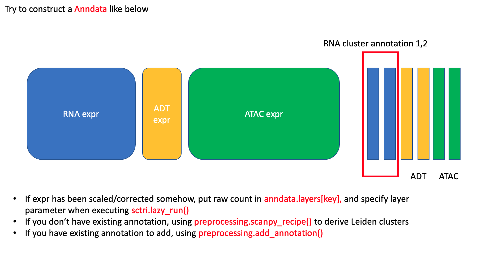

.. _tutorials:

Tutorial
==========

.. _reference_to_single_modality_workflow:

Single-Modality (scRNA-Seq) workflow
---------------------------------------

In this example, we are going to analyze the pbmc10k scRNA dataset downloaded from 
`10x official website <https://support.10xgenomics.com/single-cell-gene-expression/datasets/3.0.0/pbmc_10k_v3>`_ (chemistry v3.1). This dataset
has also been used as the demo query data in `Azimuth <https://azimuth.hubmapconsortium.org/references/#Human%20-%20PBMC>`_. It contains 11,769 single 
cells before filtering.

.. note::

    Please makse sure you have internet connection while running the tutorials, currently the program conduct gene enrichment annalysis which requires
    internet connection, we may remove this feature in the future.

Here we first conduct basic single cell analysis to obtain Leiden clustering results, however, at various resolutions (r=1,2,3). Smaller resolutions lead to
broader clusters, and larger resolution value will result in more granular clustering. We leverage scTriangulate to take the three resolutions as the query 
annotation-sets, and automatically mix-and-match cluster boundary from different resolutions, which at the end, yield scTriangulate reconciled cluster solutions.

Download and preprocessing
~~~~~~~~~~~~~~~~~~~~~~~~~~~~~

First load the packages::

    import os
    import sys
    import scanpy as sc
    from sctriangulate import *
    from sctriangulate.preprocessing import *

.. warning::

    If you experience difficulties downloading the files through the link we provided in this page,
    you can try to paste the link to the browser, and then add "http://" as prefix (not https)
    to the URL, the download will start. 

The h5 file can be downloaded from http://altanalyze.org/scTriangulate/scRNASeq/pbmc_10k_v3.h5. First use the scanpy and scTriangulate
preprocessing module to conduct basic quality control (QC) filtering and to run the single cell analysis pipeline::

    adata = sc.read_10x_h5('./pbmc_10k_v3_filtered_feature_bc_matrix.h5')
    adata.var_names_make_unique()
    adata.var['mt'] = adata.var_names.str.startswith('MT-')  # annotate mitochondrial genes as 'mt'
    sc.pp.calculate_qc_metrics(adata, qc_vars=['mt'], percent_top=None, log1p=False, inplace=True)

Visualize informative QC metrics and determine proper cutoffs::

    for key in ['n_genes_by_counts','total_counts','pct_counts_mt']:
        sc.pl.violin(adata,key,jitter=0.4)
        plt.savefig('qc_violin_{}.pdf'.format(key),bbox_inches='tight')
        plt.close()

    sc.pl.scatter(adata,x='n_genes_by_counts',y='total_counts',color='pct_counts_mt')
    plt.savefig('qc_scatter.pdf',bbox_inches='tight')
    plt.close()

.. image:: ./_static/tutorial/single_modality/qc_total_counts.png
   :height: 250px
   :width: 320px
   :align: left
   :target: target

.. image:: ./_static/tutorial/single_modality/qc_n_genes_by_counts.png
   :height: 250px
   :width: 320px
   :align: right
   :target: target

.. image:: ./_static/tutorial/single_modality/qc_pct_counts_mt.png
   :height: 250px
   :width: 320px
   :align: left
   :target: target

.. image:: ./_static/tutorial/single_modality/qc_scatter.png
   :height: 250px
   :width: 320px
   :align: right
   :target: target

Then filter out the cells whose min_genes = 300, min_counts = 500, mt > 20%. There will be 11,022 cells left::

    sc.pp.filter_cells(adata, min_genes=300)
    sc.pp.filter_cells(adata, min_counts=500)
    adata = adata[adata.obs.pct_counts_mt < 20, :]  
    print(adata)  # 11022 × 33538

Then use the scTriangulate wrapper function to obtain the Leiden clustering results at different resolutions (r=1,2,3), specifically, 
we chose the number of PCs to be 50, and the highly variable genes to be 3000::

    adata = scanpy_recipe(adata,is_log=False,resolutions=[1,2,3],pca_n_comps=50,n_top_genes=3000)

After running this command, you will populate three columns in ``adata.obs``, namely, ``sctri_rna_leiden_1``, ``sctri_rna_leiden_2``, ``sctri_rna_leiden_3``. 
Also an h5ad file named ``adata_after_scanpy_recipe_rna_1_2_3_umap_True.h5ad`` will be automatically saved to the current directory so that there is no need to re-run this
pre-processing step again. Now let's visualize these results::

    umap_dual_view_save(adata,cols=['sctri_rna_leiden_1','sctri_rna_leiden_2','sctri_rna_leiden_3'])
    # three umaps will be saved to your current directory.

.. image:: ./_static/tutorial/single_modality/three_resolutions.png
   :height: 300px
   :width: 900px
   :align: center
   :target: target

As you can see, different resolutions lead to various numbers of clusters, and it is clear that certain regions are sub-divided into sub-clusters associated with
the higher resolution clustering. However, we don't know whether these sub-populations are initially valid.
Here scTriangulate will scan each of the clusters at each resolution, and mix-and-match different solutions to achieve a reconciled result.

Running scTriangulate
~~~~~~~~~~~~~~~~~~~~~~~~~

Default lazy run
<<<<<<<<<<<<<<<<<<<<<

Running scTriangulate can be as simple as two steps. We first instantiate the ``ScTriangulate`` object, then call the ``lazy_run`` class function which will
perform all of the downstream steps automatically::

    adata = sc.read('adata_after_scanpy_recipe_rna_1_2_3_umap_True.h5ad')
    sctri = ScTriangulate(dir='./output',adata=adata,query=['sctri_rna_leiden_1','sctri_rna_leiden_2','sctri_rna_leiden_3'])
    sctri.lazy_run(assess_pruned=False,viewer_cluster=False,viewer_heterogeneity=False)  # done!!!

We first instantiate ``ScTriangulate`` object by specifying:

1. ``dir``, where do all the intermediate and final results/plots will be saved to?
2. ``adata``, the adata that we want to start with.
3. ``query``, a list that contains all the annotations that we want to triangulate.

The ``dir`` doesn't need to be an existing folder, the program will automatically create one if not present. More information about instantiation can be
found in the API :ref:`reference_to_instantiation`.

The purpose of the three arguments in ``lazy_run()`` is just to save time, you can leave it as the default by calling ``lazy_run()``, which will automatically
assess the stability of the final defined cluster as well, generate the cluster viewer and heterogeneity viewer. However, if you only want to obtain the scTriangulate
reconciled cluster information, you don't need the above three steps, so we can optionally skip these steps.

.. note::

    However for the purpose of instructing user how to understand this tool, we are going to run it step-by-step to let the user get a sense
    of how the program works. We will refer to this as a Manual Run.

Manual Run
<<<<<<<<<<<<<

Step 1: Compute Metrics
+++++++++++++++++++++++++

The first step of running scTriangulate is to determine the biologically meaningful metrics for each cluster in each resolution. By default, scTriangulate will
use ``reassign score``, ``TFIDF10 score``, ``TFIDF5 score`` and ``SCCAF score`` to measure the robustness and stability of each cluster, the metrics can be modified
through ``sctri.metrics`` attribute list::

    adata = sc.read('adata_after_scanpy_recipe_rna_1_2_3_umap_True.h5ad')
    sctri = ScTriangulate(dir='./output',adata=adata,query=['sctri_rna_leiden_1','sctri_rna_leiden_2','sctri_rna_leiden_3'])
    sctri.compute_metrics(parallel=True,scale_sccaf=True)
    sctri.serialize('break_point_after_metrics.p')   # save it for next step

After this step, 3 * 4 = 12 columns will be added to the ``sctri.adata.obs`` dataframe. 3 = 3 resolutions, 4 = 4 metrics.
Those columns store the metrics we just calculated, the first 10 rows are shown below.

.. csv-table:: After compute metrics
    :file: ./_static/tutorial/single_modality/head_check_after_metrics.csv
    :widths: 10,10,10,10,10,10,10,10,10,10,10,10,10,10,10,10,10,10,10,10,10,10,10,10,10,10
    :header-rows: 1

Step 2: Compute Shapley
++++++++++++++++++++++++

The second step is to use the calculated metrics, and assess which annotation/cluster is the best for **each single cell**. So the program iterates through each row,
representing a single cell, retrieves all the metrics associated with each cluster, and calculates a Shapley value for each cluster (in this case, each single cell has 
three conflicting clusters). Then the program will assign the cell to the "winning" cluster amongst all solutions. We refer the resultant cluster assignment as
the ``raw`` cluster result::

    sctri = ScTriangulate.deserialize('output/break_point_after_metrics.p')
    sctri.compute_shapley(parallel=True)
    sctri.serialize('break_point_after_shapley.p')

After this step, 3 + 1 + 1 + 1 columns will be added to the ``sctri.adata.obs``. They are the 3 columns corresponding to the Shapley value for each annotation, plus
one column named 'final_annotation' storing which annotation is the winner for each cell, and the column 'raw' contains raw clusters which are basically annotation
names and cluster names but concatenated by the `@` symbol. The last added column is the 'prefix', which is just a concatenation of the original cluster and the current raw cluster. 

.. csv-table:: After compute shapley
    :file: ./_static/tutorial/single_modality/head_check_after_shapley.csv
    :widths: 10,10,10,10,10,10,10,10,10,10,10,10,10,10,10,10,10,10,10,10,10,10,10,10,10,10,10,10,10,10,10,10
    :header-rows: 1

Step 3: Prune the results
++++++++++++++++++++++++++

This step is used to prune the raw result. In many cases, the raw results will contain clusters which represent a small fraction of cells relative to
the original parental cluster. In these cases, it can be advantageous to remove these more speculative results by filtering these out and reclassify
all cells against the remaining clusters. First, we evaluate the robustness of the raw clustering results using the same set of stability metrics and 
and add the relatively unstable clusters to ``invalid`` category, based on the proportion of cells in the raw results versus the source annotations.
This will be defiend by ``win_fraction < 0.25`` by default, meaning if a cluster originally has 100 cells, but has <25 cells left. The cells in these
unstable invalid clusters will be reassigned to its nearest neightbor's cluster label. After this step, we have ``pruned`` reusult::

    sctri = ScTriangulate.deserialize('output/break_point_after_shapley.p')
    sctri.prune_result()
    sctri.serialize('break_point_after_prune.p')

A column named "pruned" will be added, also a "confidence" column stores the confidence the software has to represent this cluster.

.. csv-table:: After prune result
    :file: ./_static/tutorial/single_modality/head_check_after_prune.csv
    :widths: 10,10,10,10,10,10,10,10,10,10,10,10,10,10,10,10,10,10,10,10,10,10,10,10,10,10,10,10,10,10,10,10,10,10,10,10,10,10,10,10,10,10,10,10,10
    :header-rows: 1

Step 4: Building the Viewer
++++++++++++++++++++++++++++++

We provide an automatically generated html archive, called the scTriangulate viewer, to allow users to dynamically toggle between different clusters, including the robustness of each cluster from each
annotation (cluster viewer). In addtion, it enables the inspection of further heterogeneity that might not have been captured by a 
single annotation (hetergeneity viewer). The logic of the following functions are simple. We first build the html pages, then we generate the figures that the html pages will 
need for proper rendering::

    sctri = ScTriangulate.deserialize('output/break_point_after_prune.p')
    sctri.viewer_cluster_feature_html()
    sctri.viewer_cluster_feature_figure(parallel=False,select_keys=['sctri_rna_leiden_1','pruned'])
    sctri.viewer_heterogeneity_html(key='sctri_rna_leiden_1')
    sctri.viewer_heterogeneity_figure(key='sctri_rna_leiden_1')

.. image:: ./_static/tutorial/single_modality/cluster_viewer_1.png
   :height: 300px
   :width: 600px
   :align: center
   :target: target

.. image:: ./_static/tutorial/single_modality/cluster_viewer_2.png
   :height: 300px
   :width: 600px
   :align: center
   :target: target

.. image:: ./_static/tutorial/single_modality/heterogeneity_viewer.png
   :height: 350px
   :width: 600px
   :align: center
   :target: target

Inspect the results
~~~~~~~~~~~~~~~~~~~~~~

Now we start to look at the scTriangulate results,

Comparison with Azimuth mapping
<<<<<<<<<<<<<<<<<<<<<<<<<<<<<<<<<<<

Azimuth leverages > 200 ADTs to delineate the major cell populations in PBMCs, which can serve as a silver standard. First we obtain the Azimuth mapping results 
using the h5ad object after we performed QC. Azimuth predction results can be downloaded from 
<http://altanalyze.org/scTriangulate/scRNASeq/azimuth_pred.tsv::

    sctri = ScTriangulate.deserialize('output/break_point_after_prune.p')
    add_azimuth(sctri.adata,'azimuth_pred.tsv')
    for col in ['azimuth','pruned','final_annotation']:
        sctri.plot_umap(col,'category')

.. image:: ./_static/tutorial/single_modality/azimuth.png
   :height: 400px
   :width: 500px
   :align: center
   :target: target

.. image:: ./_static/tutorial/single_modality/final_annotation.png
   :height: 400px
   :width: 500px
   :align: center
   :target: target

.. image:: ./_static/tutorial/single_modality/pruned.png
   :height: 400px
   :width: 500px
   :align: center
   :target: target

As you can see, scTriangulate can mix-and-match different resolutions, shown in the ``final_annotation`` column, and the merged final results have good 
agreement with Azimuth. 

Discover Hidden Heterogeneity
<<<<<<<<<<<<<<<<<<<<<<<<<<<<<<<<

scTrangulate, by design, can greedily discover any hidden heterogeneity via levaraging the cluster boundaries from each annotation. Here scTriangulate 
suggests sub division of the CD14 Monocyte population which has not been annotated in Azimuth reference::

    # if we run the lazy_run
    sctri = ScTriangulate.deserialize('output/after_pruned_assess.p)
    # if we run the manual step-by-step
    sctri = ScTriangulate.deserialize('output/break_point_after_prune.p')
    # next is the same
    add_azimuth(sctri.adata,'azimuth_pred.tsv')
    sctri.plot_heterogeneity('azimuth','CD14 Mono','umap')

.. image:: ./_static/tutorial/single_modality/mono_umap.png
   :height: 300px
   :width: 500px
   :align: center
   :target: target

Then by pulling out the marker genes the program detected, we reason that heterogeneity reflects at least three sub-cellular states, supported by
`literatures <https://www.ncbi.nlm.nih.gov/pmc/articles/PMC6077267/>`_:

1. **classifical CD14+ Monocyte**: CLEC5A, CLEC4D, S100A9
2. **intermediate CD14+ Monocyte**: FCGR3A, CLEC10A, HLA-DRA
3. **inflammatory CD14+ Monocyte**: MX1, MX2, IF144::

    for gene in ['CD14','FCGR3A','CLEC10A','CLEC5A','CLEC4D','MX1','MX2','IFI44','S100A9','HLA-DRA']:
        sctri.plot_heterogeneity('azimuth','CD14 Mono','single_gene',single_gene=gene,cmap='viridis')

.. image:: ./_static/tutorial/single_modality/mono_markers.png
   :height: 300px
   :width: 600px
   :align: center
   :target: target

.. _reference_to_multi_modal_workflow:

Multi-modal workflow
-----------------------------------

In this example run, we are going to use a CITE-Seq dataset from human total nucleated cells (TNCs). This dataset contains 31 ADTs and in toal 8,491 cells.
It is a common practice to analyze and cluster based on each modality seperately, and then try to merge them result together. However, to reconcile the clustering
differences are not a trivial tasks and it requires the simoutaneous consideration of both RNA gene expression and surface protein. Thankfully, scTriangulate
can help us make the decision.

the dataset can be downloaded from the http://altanalyze.org/scTriangulate/CITESeq/TNC_r1-RNA-ADT.h5.

As a more general explanation of how scTriangulate can be used in multi-modal setting, we use a pictorial representation:

Load data and preprocessing
~~~~~~~~~~~~~~~~~~~~~~~~~~~~~~~~

Load packages::

    import pandas as pd
    import numpy as np
    import os,sys
    import scanpy as sc
    from sctriangulate import *
    from sctriangulate.preprocessing import *

Load the data::

    adata = sc.read_10x_h5('28WM_ND19-341__TNC-RNA-ADT.h5',gex_only=False)
    adata_rna = adata[:,adata.var['feature_types']=='Gene Expression']
    adata_adt = adata[:,adata.var['feature_types']=='Antibody Capture']  # 8491

    adata_rna.var_names_make_unique()
    adata_adt.var_names_make_unique()

QC on RNA::

    adata_rna.var['mt'] = adata_rna.var_names.str.startswith('MT-')
    sc.pp.calculate_qc_metrics(adata_rna, qc_vars=['mt'], percent_top=None, log1p=False, inplace=True)

    for key in ['n_genes_by_counts','total_counts','pct_counts_mt']:
        sc.pl.violin(adata_rna,key,jitter=0.4)
        plt.savefig('qc_rna_violin_{}.pdf'.format(key),bbox_inches='tight')
        plt.close()

    sc.pl.scatter(adata_rna,x='n_genes_by_counts',y='total_counts',color='pct_counts_mt')
    plt.savefig('qc_rna_scatter.pdf',bbox_inches='tight')
    plt.close()

.. image:: ./_static/tutorial/multi_modal/qc_total_counts.png
   :height: 250px
   :width: 320px
   :align: left
   :target: target

.. image:: ./_static/tutorial/multi_modal/qc_n_genes_by_counts.png
   :height: 250px
   :width: 320px
   :align: right
   :target: target

.. image:: ./_static/tutorial/multi_modal/qc_pct_counts_mt.png
   :height: 250px
   :width: 320px
   :align: left
   :target: target

.. image:: ./_static/tutorial/multi_modal/qc_scatter.png
   :height: 250px
   :width: 320px
   :align: right
   :target: target

We filtered out the cells whose min_genes < 300, min_counts < 500, mt > 20%, there will be 6,406 cells kept::

    sc.pp.filter_cells(adata_rna, min_genes=300)
    sc.pp.filter_cells(adata_rna, min_counts=500)
    adata_rna = adata_rna[adata_rna.obs.pct_counts_mt < 20, :]
    adata_adt = adata_adt[adata_rna.obs_names,:]   # 6406

Perform unsupervised Leiden clustering on each of the modality, and then combined two adata objects::

    adata_rna = scanpy_recipe(adata_rna,is_log=False,resolutions=[1,2,3],modality='rna',pca_n_comps=50)
    adata_adt = scanpy_recipe(adata_adt,is_log=False,resolutions=[1,2,3],modality='adt',pca_n_comps=15)
    adata_combine = concat_rna_and_other(adata_rna,adata_adt,umap='other',name='adt',prefix='AB_')

.. image:: ./_static/tutorial/multi_modal/rna3.png
   :height: 300px
   :width: 600px
   :align: center
   :target: target

.. image:: ./_static/tutorial/multi_modal/adt3.png
   :height: 300px
   :width: 600px
   :align: center
   :target: target

Running scTriangulate
~~~~~~~~~~~~~~~~~~~~~~~~~
Just use ``lazy_run()`` function, I have broken it down in the single_modality section::

    sctri = ScTriangulate(dir='output',adata=adata_combine,add_metrics={},query=['sctri_adt_leiden_1','sctri_adt_leiden_2','sctri_adt_leiden_3','sctri_rna_leiden_1','sctri_rna_leiden_2','sctri_rna_leiden_3'])
    sctri.lazy_run(assess_pruned=False,viewer_cluster=False,viewer_heterogeneity=False)

All the intermediate results will be stored at ./output folder.

Inspect the results
~~~~~~~~~~~~~~~~~~~~~~~

scTriangulate allows the triangulation amongst diverse resolutions and modalities::

    # get modality contributions
    sctri = ScTriangulate.deserialize('output/after_pruned_assess.p')
    sctri.modality_contributions()
    for col in ['adt_contribution','rna_contribution']:
        sctri.plot_umap(col,'continuous',umap_cmap='viridis')

    # get resolution distribution
    col = []
    for item in sctri.adata.obs['pruned']:
        if 'leiden_1@' in item:
            col.append('resolution1')
        elif 'leiden_2@' in item:
            col.append('resolution2')
        elif 'leiden_3@' in item:
            col.append('resolution3')
    sctri.adata.obs['resolution_distribution'] = col
    sctri.plot_umap('resolution_distribution','category')

.. image:: ./_static/tutorial/multi_modal/contributions.png
   :height: 300px
   :width: 600px
   :align: center
   :target: target

.. image:: ./_static/tutorial/multi_modal/resolutions.png
   :height: 300px
   :width: 400px
   :align: center
   :target: target

scTriangulate can visualize the top markers in each cluster, example output see ``plot_multi_modal_feature_rank`` ::

    sctri.plot_multi_modal_feature_rank(cluster='sctri_rna_leiden_3@6')

scTriangulate discovers new cell states from the ADT markers (CD56 high MAIT cell), supported by `previous literature <https://www.pnas.org/content/114/27/E5434>`_,
azimuth prediction can be downloaded from http://altanalyze.org/scTriangulate/CITESeq/azimuth_pred.tsv::

    sctri = ScTriangulate.deserialize('output/after_pruned_assess.p')
    add_azimuth(sctri.adata,'azimuth_pred.tsv')
    sctri.adata.obs['dummy_key'] = np.full(sctri.adata.obs.shape[0],'dummy_cluster')
    sctri.plot_heterogeneity('dummy_key','dummy_cluster','umap',col='azimuth',subset=['CD8 TEM','CD4 CTL','MAIT','dnT','CD8 Naive'])
    sctri.plot_heterogeneity('dummy_key','dummy_cluster','umap',col='pruned',subset=['sctri_rna_leiden_3@6','sctri_rna_leiden_2@15','sctri_adt_leiden_3@37','sctri_adt_leiden_3@32','sctri_rna_leiden_1@9'])
    sctri.plot_heterogeneity('dummy_key','dummy_cluster','single_gene',col='azimuth',subset=['CD8 TEM','CD4 CTL','MAIT','dnT','CD8 Naive'],single_gene='AB_CD56',umap_cmap='viridis')

.. image:: ./_static/tutorial/multi_modal/novel.png
   :height: 350px
   :width: 600px
   :align: center
   :target: target

