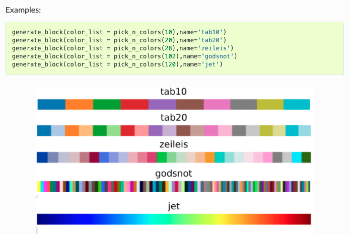
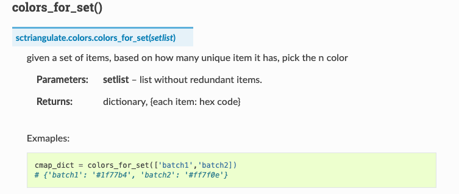
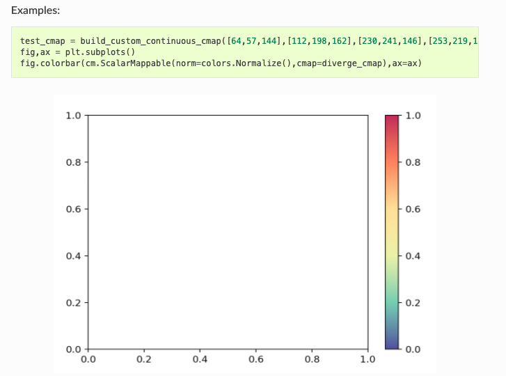
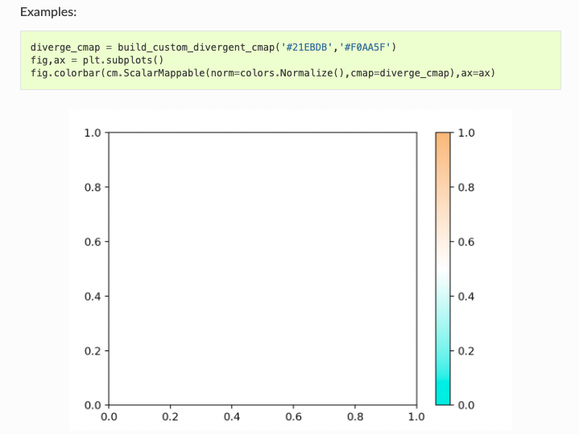
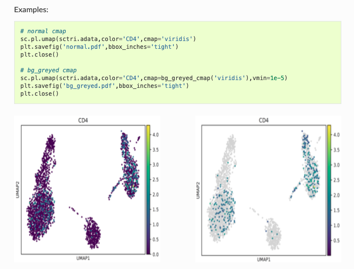

# scTriangulate colors module

## An One Stop solutions for any color related problems in Python

As a seperate module in scTriangulate, `colors` module contains several handy functions for the tasks that you may frequently encounter in your analysis. If you have any feature request, please let me know and I will implement and add them to the modules.

### pick_n_colors

Imagining you just want to have `n` discrete colors to represent `n` differnet entities, the entity can be different categories, different batches, different countries, etc. This function will do the job for you, `n` can be any arbitrary interger.

See [pick_n_colors](https://sctriangulate.readthedocs.io/en/latest/api.html#pick-n-colors) API for more details.

### colors_for_set

Similar to the scenario as `pick_n_colors`, but if you want to obtain a dictionary/mapping of your entities to the colors, this function do the job for you.

See [colors_for_set](https://sctriangulate.readthedocs.io/en/latest/api.html#colors-for-set) for more details.

### build_custom_continuous_cmap

So this function allows you to build any custom continous colormap at your own wills.

See [build_custom_continuous_cmap](https://sctriangulate.readthedocs.io/en/latest/api.html#build-custom-continuous-cmap) API for more details.

### build_custom_divergent_cmap

This function allows you to build any custom divergent colormap at your own wills.

See [build_custom_divergent_cmap](https://sctriangulate.readthedocs.io/en/latest/api.html#build-custom-divergent-cmap) API for more details.

## bg_greyed_cmap

This function can make the any matplotlib colormap object's background grey.

See [bg_greyed_cmap](https://sctriangulate.readthedocs.io/en/latest/api.html#bg-greyed-cmap)

